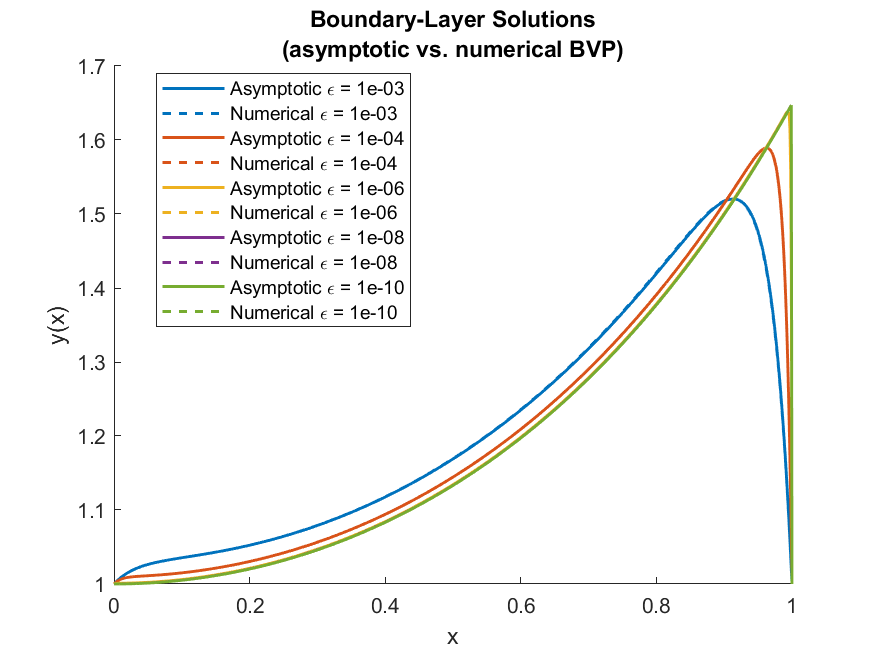
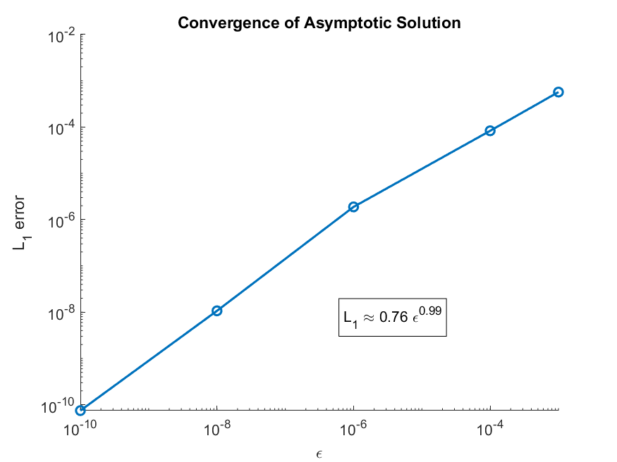

# Boundary-Layer — Matching Approximation vs. Numerical Solution

This mini-repo studies the first-order convergence of a boundary layer's **matched-asymptotic approximation** towards a fully numerical
solution of the underlying singularly-perturbed ODE.

---

<p align="center">
  
  
</p>

## Problem statement

We consider  

ε y‴(x) − y′(x) + x y(x) = 0  x ∈ [0, 1]
y(0) = 1, y′(0) = 1, y(1) = 1

where 0<ε<<1 creates a thin boundary layer near
x=1.

* **Uniform approximation**  
  Built with matching:  
  outer solution + inner layer → matched and combined.

* **Numerical reference**  
  Reformulated as a first-order system and solved with MATLAB `bvp4c`.

To test convergence of the asymptotic approximation, we sweep several values of ε and track the **L₁-error** between the two
solutions. Results show a first-order logarithmic convergence.

---

## Repository layout

| Path               | Purpose                                    |
|--------------------|--------------------------------------------|
| `compare_uniform_vs_numerical.m` | Main script—runs everything and saves the figures |
| `fig/`             | Output images are written here (auto-created) |
| `README.md`        | What you are reading |

---

## Quick start

```bash
git clone https://github.com/<your-user>/boundary-layer-bvp.git
cd boundary-layer-bvp
matlab -batch "compare_uniform_vs_numerical"